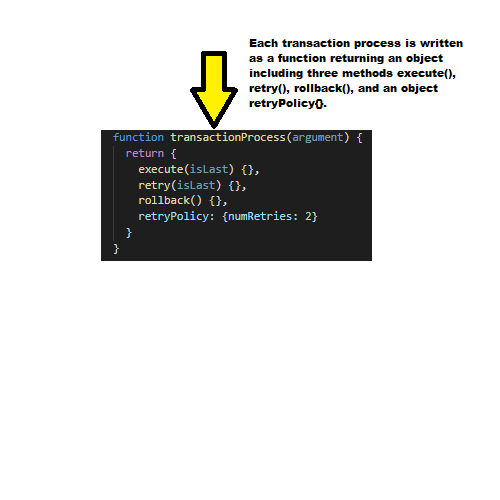

# txn

Flexible transaction management. Learn more about it in our [blog post](https://blog.cheapreats.com/handling-transactions-at-cheapreats/).

## Install

```
$ npm install @cheapreats/txn --save
```

## Links
[npm-url](https://npmjs.org/package/transaction_management)
|
[github-url](https://github.com/KevinMoorman/TransactionManagement)
|
[Repl.it-url](https://repl.it/@KevinMoorman/Yield-Generator#index.js)

## How to Define a Transaction
Each transaction must succeed or fail as a complete unit. A transaction can never be partially complete. A transaction is written as a generator function `*placeOrder()` which in turn yields a sequence of transaction processes such as `calculateTotal(orderId)`, `updateCouponUsage(couponNumber)`, `chargeVendorFee()`, `chargeCreditCard(ccNumber)`, and `saveOrder(orderId)`.

## How to Define a Transaction Process

<div></div>

Each transaction process is written as a function returning an object including three methods `execute()`, `retry()`, `rollback()`, and an object `retryPolicy{}`.

Both `execute()` and `retry()` are provided a boolean argument in which true indicates that this attempt is the last possible attempt, or false if there are retries remaining.

Both `execute()` and `retry()` will return a boolean in which true indicates success and false indicates failure.

The object `retryPolicy{}` includes the numeric variable `numRetries` with a non-negative integer value of 0 or more. The transaction processes are executed sequentially and all retries attempted until the policy is exhausted. If the retry policy is exhausted, all transaction processes that had been successfully completed will have their `rollback()` method called in reverse sequence.

The `executeTransaction()` method returns a boolean value in which true indicates success of the whole transaction and false indicates that the whole transaction had failed. In the case of false, any individual transaction process that had succeeded will have also been rolled back.

## Usage

```javascript
var transact = require('transaction_management');

transact.executeTransaction( placeOrder() );

function *placeOrder() {
  yield transact.calculateTotal(orderId);
  yield transact.updateCoupon(couponNumber);
  yield transact.chargeVendorFee();
  yield transact.chargeCreditCard(ccNumber);
  yield transact.saveOrder(orderId);
}

//=>

Attempting to calculate total for order ${orderId}... Failed/Succeeded.
Attempting to update coupon ${couponNumber}... Failed/Succeeded.
Attempting to charge vendor fee... Failed/Succeeded.
Charging credit card with ccNumber ${ccNumber}... Failed/Succeeded.
Saving order ${orderId}... Failed/Succeeded.
Rolled back credit card charge for ${ccNumber}.
Rolled back vendor charge.
Rolled back coupon ${couponNumber} update.
Rolled back order ${orderId} total calculation.
```
